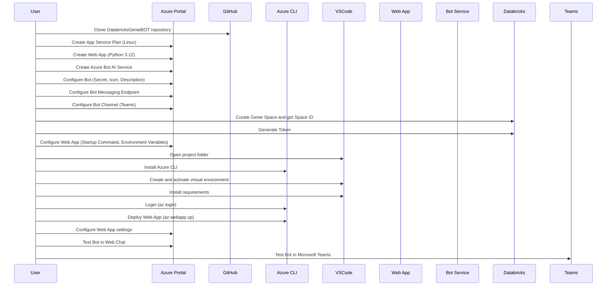

# Databricks Genie 機器人

## 目標

本專案實作了一個實驗性聊天機器人，與 Databricks 的 Genie API 互動，該 API 目前處於私人預覽階段且未獲得官方支援（若有變更將會更新）。此機器人旨在透過像 MS Teams 這樣的聊天介面，促進與 Databricks 的 AI 助理 Genie 的對話。

## 概述

此實驗性程式碼使用 Genie API 在 Databricks 中建立了一個 Genie 機器人。請注意，這不是生產就緒的程式碼，也不與任何雇主相關聯或獲得其認可。此程式碼僅供實驗和學習目的按原樣使用。

## 主要功能

- 與 Databricks 的 Genie API 整合，以開始對話並處理後續訊息
- 處理使用者查詢並呈現 Genie 的回應
- 管理多個使用者的對話狀態
- 將查詢結果格式化並顯示為可讀的 Markdown 表格
- 處理來自 Genie 的澄清請求
- **新功能**：整合讚/倒讚回饋系統，將回饋直接發送到 Databricks Genie API
- 具有適當錯誤處理和使用者通知的即時回饋收集
- **🎨 圖表視覺化**：自動生成圖表圖片（長條圖、圓餅圖、折線圖）並顯示在 Teams 中
  - 智能判斷數據類型並選擇最適合的圖表
  - 使用 Plotly 生成現代化、美觀的圖表圖片
  - 支持中文標籤和標題
  - 通過 Adaptive Card 無縫顯示
  - 詳細說明請參閱 [CHART_FEATURE_GUIDE.md](CHART_FEATURE_GUIDE.md)

### 📖 架構優化和最佳實踐

本項目已進行全面的架構分析，識別了 10 個改善領域。請參閱以下指南：

### 🚀 快速開始 (立即改善)

- **[docs/architecture/optimization.md](docs/architecture/optimization.md)** - 完整性能優化指南（實施狀態、快速開始、詳細建議）
- **[docs/troubleshooting.md](docs/troubleshooting.md)** - 完整故障排查指南（所有常見問題和解決方案）

#### 立即改善的 3 大核心問題

1. **內存洩漏風險** ⭐⭐⭐⭐⭐ - 會話無自動清理 (24h 後 OOM)
2. **無監控和可觀測性** ⭐⭐⭐⭐⭐ - 無法診斷性能問題
3. **沒有 API 容錯機制** ⭐⭐⭐⭐⭐ - 偶發故障導致查詢失敗

**預期收益**: 2-3 小時工作可實現 → 99.9% 可用性 + 99.5% 成功率 + 完全可視化

---

## 📖 架構優化和最佳實踐

本項目已進行全面的架構分析，識別了 10 個改善領域。請參閱以下指南：

### 🚀 快速開始 (立即改善)

- **[docs/architecture/optimization.md](docs/architecture/optimization.md)** - 3 大核心改善概述和行動計劃

#### 立即改善的 3 大核心問題

1. **內存洩漏風險** ⭐⭐⭐⭐⭐ - 會話無自動清理 (24h 後 OOM)
2. **無監控和可觀測性** ⭐⭐⭐⭐⭐ - 無法診斷性能問題
3. **沒有 API 容錯機制** ⭐⭐⭐⭐⭐ - 偶發故障導致查詢失敗

**預期收益**: 2-3 小時工作可實現 → 99.9% 可用性 + 99.5% 成功率 + 完全可視化

---

## 實作細節

機器人使用以下技術建構：

- Python
- Bot Framework SDK
- 用於非同步 HTTP 請求的 aiohttp
- Databricks Genie API（公開預覽版）

系統的主要組件包括：

- `ask_genie` 函數，處理與 Genie API 的通訊
- `MyBot` 類別，處理傳入訊息並管理使用者對話
- 一個 aiohttp Web 應用程式，作為機器人訊息的進入點
- **新功能**：整合回饋系統，使用發送訊息回饋端點將使用者回饋直接發送到 Databricks Genie API

## 工作階段管理架構

### 驗證如何運作

機器人使用 **單一 Databricks 權杖**（透過 `DATABRICKS_TOKEN` 設定）來驗證對 Databricks Genie API 的所有請求。這是機器人代表所有使用者使用的共享憑證。

### 使用者工作階段如何管理

雖然使用單一權杖進行 API 驗證，但機器人為每個使用者維護 **獨立的工作階段上下文**：

1. **使用者識別**：每個使用者由其電子郵件地址識別（手動提供或來自 Teams 設定檔）
2. **工作階段隔離**：每個使用者獲得自己的 `UserSession` 物件，該物件追蹤：
   - 使用者電子郵件和名稱
   - 與 Genie 的個別對話 ID
   - 對話歷史和上下文
   - 最後活動時間戳記
   - 使用者特定偏好

3. **對話上下文**：機器人為每個使用者維護獨立的 Genie 對話執行緒，確保：
   - 使用者 A 的問題不會影響使用者 B 的對話
   - 每個使用者都可以在自己的上下文中提出後續問題
   - 對話在閒置 4 小時後自動重置前會被保留

4. **查詢記錄**：當查詢發送到 Genie 時，使用者的電子郵件會附加到問題前面，以便在 Databricks 中進行追蹤：

   ```text
   [user@company.com] 什麼是最暢銷的產品？
   ```

### 此架構的優點

- **簡化管理**：管理單一權杖而不是每個使用者的憑證
- **使用者隱私**：每個使用者的對話與其他人隔離
- **上下文保留**：使用者可以與 Genie 進行自然的多輪對話
- **稽核追蹤**：所有查詢都在 Databricks 中記錄並歸屬給使用者
- **可擴展性**：只需最少的設定即可支援許多並發使用者

### 安全考量

- Databricks 權杖應具有存取 Genie Space 的適當權限
- 使用者電子郵件僅用於記錄，不用於驗證
- 工作階段儲存在記憶體中，並在閒置 4 小時後清除
- 在生產環境中，考慮使用 Azure Key Vault 儲存 Databricks 權杖

### 其他驗證選項

- 雖然此機器人使用單一權杖來管理許多使用者，但如果您選擇，您可以透過 OAuth 連接 Databricks 和 Teams。這只是我們建立的範例

## 免責聲明

此程式碼是實驗性的，使用尚未由 Databricks 支援的公開預覽 API。它不應在生產環境中使用，僅供教育和實驗目的使用。使用風險自負。

程式碼已在 Azure Bot Framework 中測試，該框架有助於與任何聊天機器人（如 MS Teams）整合。

## 設定和使用

### 🚀 快速開始 (5 分鐘)

詳見 [docs/setup/quick_start.md](docs/setup/quick_start.md) - 包含完整安裝步驟和常見問題修復

### 基本步驟

### 基本步驟

0. Python 版本 3.11+
1. 安裝 `uv` (推薦) 並執行 `uv sync` 安裝依賴
2. 設定必要的環境變數（請參閱下面的環境變數部分）
3. 執行 `uv run fastapi dev app/main.py` 以啟動機器人
4. 透過 Azure Bot Framework 呼叫機器人端點 (port 8000)

### 🔍 環境診斷

```bash
# 自動檢查和修復常見問題
python scripts/diagnose.py
```

## 環境變數

應用程式使用環境變數進行設定。您可以在部署環境（GitHub Actions、Azure 等）中設定這些變數，或為本地開發建立 `.env` 檔案。

將 `env.example` 複製到 `.env` 並填入您的值：

```bash
cp env.example .env
```

### 必要環境變數

- `DATABRICKS_TOKEN`: 您的 Databricks 個人存取權杖（必要）

### 生產環境變數

- `APP_ID`: 您的 Azure Bot Service 應用程式 ID
- `APP_PASSWORD`: 您的 Azure Bot Service 應用程式密碼
- `APP_TENANTID`: 您的 Azure 租戶 ID

### 選用環境變數

- `PORT`: 應用程式的連接埠號碼（預設：3978）
- `APP_TYPE`: 機器人類型 - "SingleTenant" 或 "MultiTenant"（預設："SingleTenant"）
- `DATABRICKS_SPACE_ID`: Genie 對話將發生的 Databricks Space ID（有預設值）
- `DATABRICKS_HOST`: 您的 Databricks 工作區 URL（有預設值）
- `SAMPLE_QUESTIONS`: 以分號分隔的範例問題列表，在使用者首次登入時顯示。根據您的特定 Genie 空間和使用案例自訂這些問題（預設：關於資料可用性的通用問題）
- `ADMIN_CONTACT_EMAIL`: 在 info 指令中顯示給使用者以進行支援查詢的電子郵件地址（預設：`admin@company.com`）
- `ENABLE_FEEDBACK_CARDS`: 啟用/停用回饋收集（預設：True）
- `ENABLE_GENIE_FEEDBACK_API`: 啟用/停用發送回饋到 Databricks Genie API（預設：True）

### Microsoft Graph API 設定（新功能）

機器人現在支援透過 Microsoft Graph API 自動取得使用者資訊，包括 email 和 OpenID (Azure AD Object ID)：

- `ENABLE_GRAPH_API_AUTO_LOGIN`: 啟用/停用自動從 Graph API 取得使用者資訊（預設：False）
- `OAUTH_CONNECTION_NAME`: Azure Portal 中設定的 OAuth Connection 名稱（預設：空）

**如何設定 Graph API：**

2. 請參閱 `docs/troubleshooting.md` 獲取更多資訊
3. 在 Azure Portal 的 Bot Channels Registration 中設定 OAuth Connection
4. 設定必要的 API 權限：`openid`, `email`, `profile`, `User.Read`
5. 設定環境變數 `ENABLE_GRAPH_API_AUTO_LOGIN=True`

**優點：**

- ✅ 自動取得使用者 email（無需手動輸入）
- ✅ 取得 Azure AD Object ID (OpenID)
- ✅ 取得完整的使用者個人資料（Display Name、UPN 等）
- ✅ 更好的使用者體驗

詳細設定步驟請參閱 [docs/troubleshooting.md](docs/troubleshooting.md)

請參閱程式碼註解以獲取有關每個組件功能的更詳細資訊。

## 回饋系統

機器人現在包含一個整合的回饋系統，允許使用者對 Genie 回應提供讚/倒讚回饋。此回饋使用發送訊息回饋端點直接發送到 Databricks Genie API。

### 運作方式

1. **自動回饋卡**：在每個 Genie 回應後，使用者會看到帶有讚 (👍) 和倒讚 (👎) 按鈕的回饋卡
2. **即時提交**：當使用者點擊回饋按鈕時，回饋會立即發送到 Databricks Genie API
3. **錯誤處理**：如果 API 呼叫失敗，使用者會看到錯誤訊息並可以重試
4. **設定**：回饋系統可以透過環境變數啟用/停用

### 發送到 Genie API 的回饋資料

- **訊息 ID**：對話中的實際 Genie 訊息 ID
- **對話 ID**：Genie 對話 ID
- **回饋類型**：`POSITIVE` 或 `NEGATIVE`
- **空間 ID**：發生對話的 Databricks Space ID

**API 請求格式：**

```json
{
  "rating": "POSITIVE"
}
```

或

```json
{
  "rating": "NEGATIVE"
}
```

### 設定選項

- `ENABLE_FEEDBACK_CARDS`: 控制是否向使用者顯示回饋卡
- `ENABLE_GENIE_FEEDBACK_API`: 控制是否將回饋發送到 Genie API
- 兩個選項預設為 `True` 以獲得完整功能

## 自訂範例問題

當使用者首次登入時，機器人會向他們顯示可以詢問有關其資料的範例問題。您可以自訂這些問題以符合您的特定 Genie 空間和使用案例。

### 如何自訂

1. **透過環境變數**：設定 `SAMPLE_QUESTIONS` 環境變數，使用分號分隔問題：

   ```bash
   SAMPLE_QUESTIONS=本月最暢銷的產品是什麼？;顯示客戶流失率;我們的收入趨勢如何？
   ```

2. **透過 .env 檔案**：在您的 `.env` 檔案中新增或更新該行：

   ```bash
   SAMPLE_QUESTIONS=本月最暢銷的產品是什麼？;顯示客戶流失率;我們的收入趨勢如何？
   ```

3. **在 config.py 中**：如果未設定環境變數，預設問題定義在 `config.py` 中

### 範例

**對於銷售資料：**

```bash
SAMPLE_QUESTIONS=本月最暢銷的產品是什麼？;按地區顯示收入;誰是我們收入最高的客戶？
```

**對於支援工單：**

```bash
SAMPLE_QUESTIONS=工單的不同狀態及其計數是什麼？;誰是我表現最好的代理人？;平均解決時間是多少？
```

**對於 IoT/感測器資料：**

```bash
SAMPLE_QUESTIONS=顯示過去 24 小時的溫度趨勢;哪些感測器報告異常？;按設備類型的平均正常運行時間是多少？
```

**對於一級方程式/體育資料：**

```bash
SAMPLE_QUESTIONS=今年的車隊排名如何？;哪位車手獲勝次數最多？;顯示過去 10 場比賽的排位賽位置
```

機器人將在使用者首次登入時向他們顯示這些問題，使他們能夠輕鬆開始進行相關查詢。

## 與 MS Teams 整合


